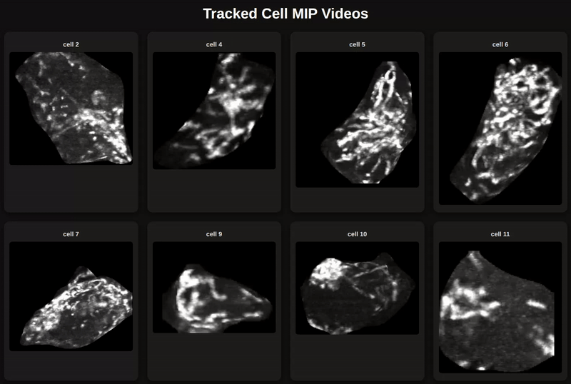

# MitoDev – 4D Cell Segmentation and Tracking

This repository contains the code for the paper **production-ready pipeline**:

* Downloading a sample data
* Segmenting cells using **Cellpose**
* Running mitochondrial tracking
* Generating **per-cell MIP videos**
* Visualizing all cells in a **HTML dashboard**

The included dataset is intentionally small for demonstration purposes: tracking is run on 10 frames instead of 60, and the number of extracted cells is limited to 10. For full-scale datasets, several pipeline stages are computationally intensive and may take hours to complete, depending on dataset size and hardware.


Here’s an example of MitoDev output in action:



---

## Getting Started
Clone the repository:
```bash
git clone git@github.com:schoeneberglab/MitoDev.git
cd MitoDev
```

## 📁 Repository Structure
.
├── config.yaml
├── main.py
├── visualise_in_html.py
├── scripts/
│   ├── download.sh
│   ├── run_cellpose.sh
├── data/
├── README.md
```

---

## ⚙️ Environment Setup

### 1️⃣ Install `uv`

`uv` is used for fast, reproducible Python environment and dependency management.

#### macOS (recommended via Homebrew)

```bash
brew install uv
```

#### Linux (and macOS without Homebrew)

```bash
curl -LsSf https://astral.sh/uv/install.sh | sh
```

After installation, restart your shell or run:

```bash
source ~/.bashrc
# or
source ~/.zshrc
```

Verify installation:

```bash
uv --version
```

> **Note:** `uv` installs to `~/.cargo/bin` by default. Ensure this directory is in your `PATH`.

---

### 2️⃣ Create Virtual Environment

```bash
make venv
```

This will:

* Install Python 3.10
* Create a virtual environment at `.mitodev/`
* Install all required dependencies

---

### 3️⃣ Activate Environment

```bash
source .mitodev/bin/activate
```
---

## 📥 Data Download

Download the raw dataset into the `data/` directory:

```bash
bash scripts/download.sh ./data
```

⏱ **Runtime**:

* Depends on network speed
* Can take several minutes

---

## 🧠 Cell Segmentation (Cellpose)

Run Cellpose on the processed data directory:

```bash
bash scripts/run_cellpose.sh "./data/20231221 Gillian Lung Organoid/Sample 1/1/Processed_Data" 0 10
```

Arguments:

* **Processed data path**
* **Start index**
* **End index (exclusive)**

⏱ **Runtime**:

* **Can take hours**
* Strongly recommended to run on a machine with GPU support

---

## 🧬 Mitochondrial Tracking

Run the main processing pipeline:

```bash
python -m main ./config.yaml "20231221 Gillian Lung Organoid/Sample 2" 1 --minimal
```

Arguments:

* `config.yaml`: Pipeline configuration
* Sample name
* Sample index
* `--minimal`: Runs a reduced output version (recommended for testing)

⏱ **Runtime**:

* **Several hours** depending on:

  * Number of cells
  * Timepoints

---

## 🎥 Cell Visualization (MIP Videos → HTML)

Generate **per-cell MIP videos** and embed them into a **self-contained HTML page**:

```bash
python visualise_in_html.py --root "./data/20231221 Gillian Lung Organoid/Sample 1/1/single_cells/"
```

This will:

* Traverse all tracked cells
* Generate MIP MP4 videos
* Embed all videos directly into an HTML file

📄 Output:

```
index_embedded.html
```

You can open this file **on any system**, even without access to the data or Python.

---

## 🖥️ Hardware Recommendations

| Task          | Recommendation           |
| ------------- | ------------------------ |
| Cellpose      | GPU strongly recommended |
| Main pipeline | GPU + high RAM           |
| Visualization | CPU sufficient           |

---

## ⚠️ Notes

* Some pipeline stages are **long-running** by design

---

## 📬 Contact

For issues, improvements, or extensions, please open a GitHub issue or contact the maintainers.

---